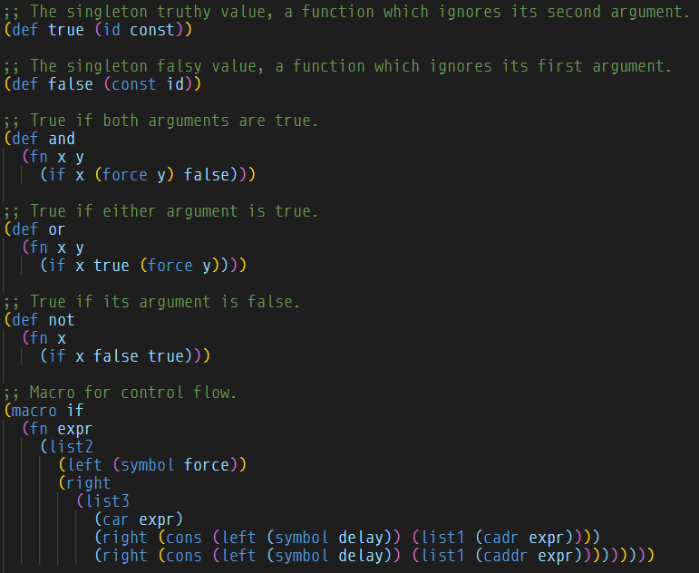

# VSCode-M



A VSCode plugin for the M programming language.

## To Use

```bash
git clone https://github.com/m-language/vscode-m
cd vscode-m
vsce package
```

Then go to `Extensions -> ... -> Install From VSIX...` and select `vscode-m.vsix`.
